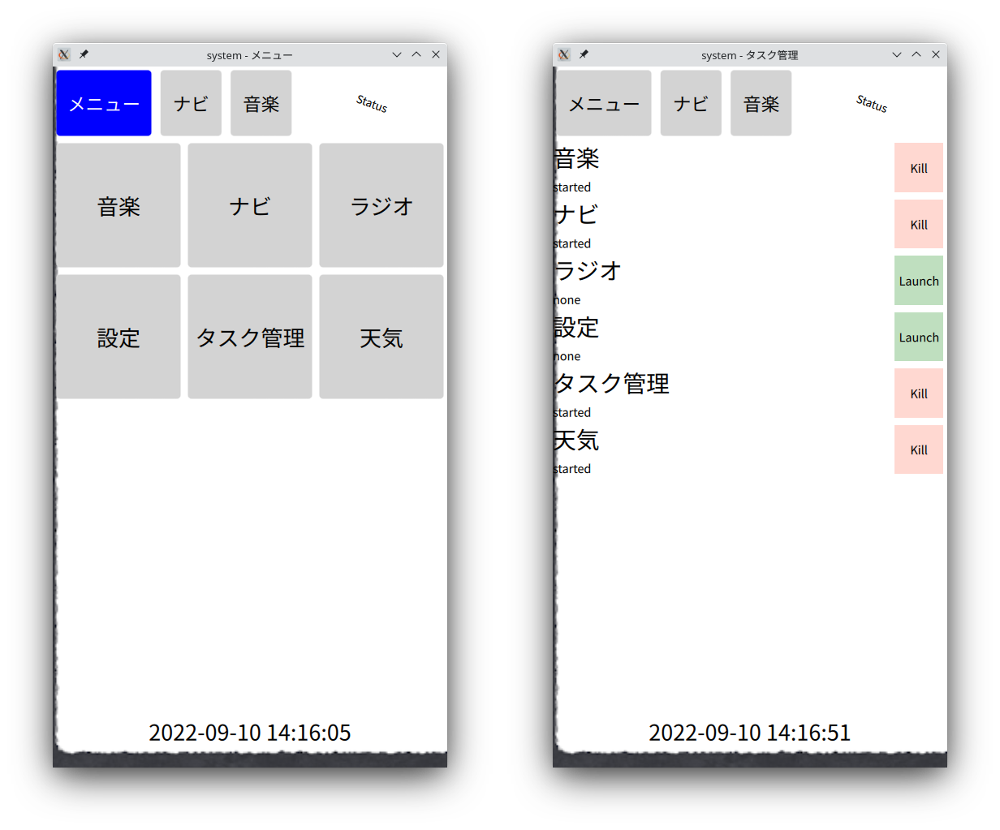
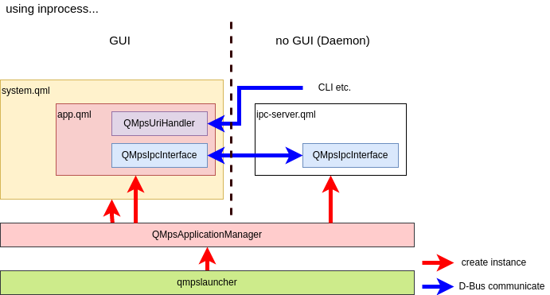
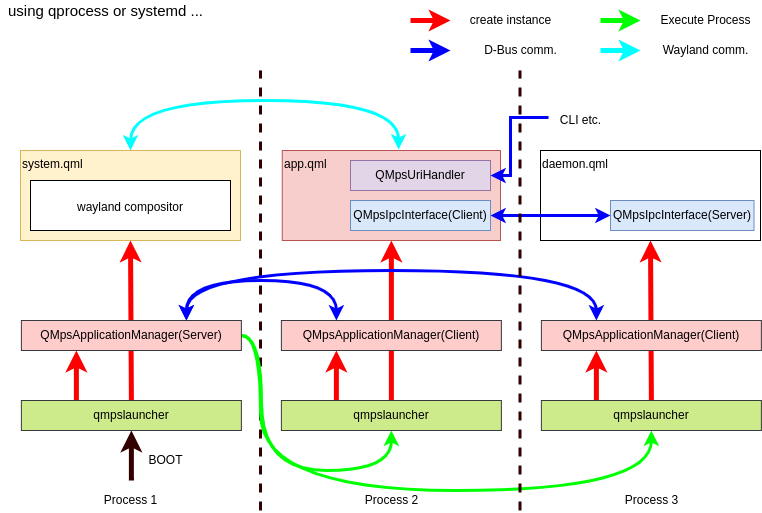

# QtMultiProcessSystem

QtMultiProcessSystem (以下 QtMPS )は以下の特徴を持つアプリケーションフレークワークです

以下の機能を提供します

* 記述した複数のアプリケーションをシングルプロセスまたはそれぞれ別の複数のプロセスとして実行できます
  * 実行の形態はコード記述に依存せず、実行時に選択できます
* GUIアプリケーションの統合機能
  * マルチプロセス時 WaylandCompositorの機能
* 複数のWatchDog Timerの管理機能
* D-Bus を介した IPC の仕組み
 
## How to build and deploy

```bash
$ git clone https://github.com/task-jp/qtmultiprocesssystem.git
$ mkdir build
$ cd build
$ /path/to/qmake -r ../qtmultiprocesssystem/qtmultiprocesssystem.pro
$ make
$ make install
```

### Try Examples

examples にはモバイルデバイスを模したシステムを用意しています。
これには複数の QtQuick アプリケーションが含まれています。

以下のようにビルド、デプロイして、
```bash
$ make sub-examples
$ make sub-examples-install_subtargets
```
全アプリケーションをまとめてシングルプロセスの QtQuick アプリケーションとして動作させる場合は以下のようにします
```bash
## Execute as Single-Process
$ /path/to/qmpslauncher -c example -w monolithic -a inprocess
```
各アプリケーションごとにプロセスをわけて動作させる場合は以下のようにします
```bash
## Execute as Multi-Process
$ /path/to/qmpslauncher -c example -w wayland -a qprocess
```
いずれの実行形態であっても見た目も操作も同じように動作します



## Structure

### Case: execute as Single process


### Case: execute as Multi process


## QMpsIpcInterface

プロセス間通信(Inter Process Call) の機能を提供します
現状、D-Bus を用いて実装されています

QtObject クラスの内容がサーバー・クライアント間で同期され、
サーバー側インスタンスで提供する以下の内容をクライアント側からも操作できます
* Q_PROPERTY で指定したプロパティの読み書き
* シグナルの呼び出し
* スロットの実行
* Q_INVOKABLE で指定したメソッドの実行

## QMpsUriHandler

D-Bus を介して URI を受付ける機能を提供します
このクラスを利用することで dbus-send や qdbus といった一般的な D-Bus 操作コマンドを用いて、
CLI からでもアプリケーションの実行やアクセスを行えるようになります

## QMpsApplicationManager

QMpsApplication の起動・停止、ステータス管理を提供します
以下のタイプが提供されます

* inprocess
  * QMpsApplicationManager と同じプロセス内に QMpsApplication をロード・実行します
* qprocess
  * QMpsApplicationManager と別プロセスに QMpsApplication をロード・実行します
  * 実行には QMpsApplicationManager を実行したランチャーコマンドと同じコマンドを用います
* systemd
  * QMpsApplicationManager と別プロセスに QMpsApplication をロード・実行します
  * 実行には systemd を用います
    * 各 QMpsApplication を実行するためのサービスユニットが必要です

## QMpsWindowManager

QMpsApplication のうち、GUI を持つものについてGUIウインドウの管理手段を提供します
以下のタイプが提供されます

* monolithic
  * QMpsWindowManager は特に何もしません
  * QMpsApplicationManager には inprocess が指定されているべきです
* wayland
  * compositor に指定された QMpsApplication に wayland compositor としての機能を提供します
    * QMpsApplication に wayland compositor としての機能・記述は不要です
  * 他の QMpsApplication は wayland client として動作します
  * QMpsApplicationManager には qprocess または systemd が指定されているべきです

## QMpsWatchDogManager

QMpsApplication に Watchdog Timer の管理機能を提供します
以下のタイプが提供されます

* none
  * Watchdog Timer を使用しません
* inprocess
  * 対象の Watchdog Timer の管理機能を提供します
    * MainThreadWatchDog
    * RenderThreadWatchDog
  * 提供可能な Watchdog Timer は以下の通りです
    * MainThreadWatchDog
      * メインスレッドのイベントループによって KeepAlive を送出します
    * RenderThreadWatchDog
      * 描画によって KeepAlive を送出します
    * XdgShellWatchDog
      * Wayland 使用時 Wayland プロトコル内の通信で KeepAlive を送出します
    * SystemdWatchDog
      * Systemd 使用時 Systemd の提供する Watchdog ソケットへ KeepAlive を送出します
        * サービスユニットに設定が必要です
